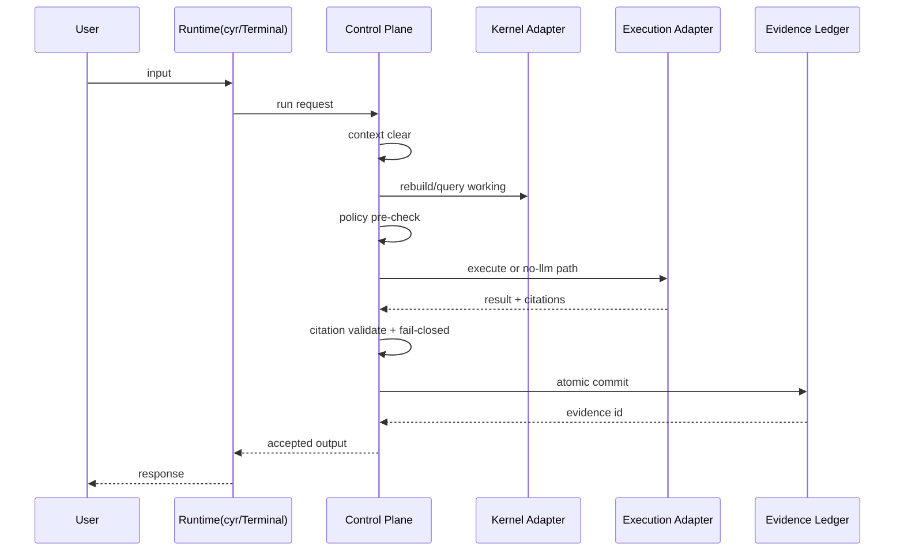

# CYRUNE Free v0.1 アーキテクチャ概要（正典）

**作成日時 (JST)**: 2026-03-14

本書は CYRUNE Free v0.1 の**設計思想**・**責務境界**・**主要コンポーネント**を要約し、正典を読む人が迷わず「何を握り、何を握らないか」を理解できる状態を作ります。

## public-side reading guide

この文書を public corpus から読む場合は、次の順序で読めば十分である。

1. `../../docs/CYRUNE_Free_Public_Index.md`
2. `../00-TARGET_SYSTEM.md`
3. `../summary/01-SYSTEM_AND_SCOPE.md`
4. `../summary/02-ARCHITECTURE_AND_RUNTIME_LINES.md`
5. `../summary/07-CURRENT_STATE_AND_OPERATIONAL_GUIDE.md`

---

## 1. 設計思想

CYRUNE Free v0.1 が価値として固定するのは次です。

- **Control Plane First**: Free の価値は Control Plane にあり、Runtime や LLM を本体化しない。
- **Boundary Before Convenience**: 便利さより、Kernel 純粋性、上位ティア境界、Terminal 非侵食を優先する。
- **Fail-Closed and Evidence-First**: 未検証なら実行しない。実行したものは atomic ledger に残す。
- **Deterministic Surface**: `cyr` を単一入口とし、Working、Policy、Ledger、実行経路を追跡可能にする。

---

## 2. システム境界

### 2.1 自前で握るもの（CYRUNE Free）

- Control Plane
- Working 10±2 の意味論
- Policy / Gate
- Citation bundle と validate
- Evidence Ledger
- `cyr`、viewer、Terminal 起動統合
- Execution adapter の許可 / 実行制御

### 2.2 委譲 / 依存するもの

- CRANE-Kernel の 6 interface と typed envelope 契約
- Kernel adapter が提供するストレージ / インデックス / 埋め込み実装
- WezTerm の端末責務
- approved execution adapter が提供するモデル / connector 実行

---

## 3. 主要コンポーネント

### 3.1 Runtime Projection Layer

- `cyr`、viewer、Terminal 統合を持つ。
- ユーザー入力と表示を担う。
- 統制ロジックは持たず、必ず Control Plane に委譲する。

### 3.2 Control Plane Layer

- 1ターン実行の中核。
- context clear、Working 再構築、Policy pre-check、Execution、Citation validate、Fail-Closed、Ledger 確定を握る。
- CYRUNE Free の価値の中心。

### 3.3 Kernel Adapter Layer

- CRANE 契約の実装差分を吸収する。
- ストレージ、インデックス、埋め込みを担う。
- Capability Manifest / Binding / Resolver の対象。

### 3.4 Execution Adapter Layer

- No-LLM、Local LLM、approved connector / executor を持つ。
- Control Plane に許可された時だけ実行される。
- Kernel adapter と用語を混ぜない。

### 3.5 CRANE Contract Layer

- MemoryStore、Query、EmbeddingEngine、ForgettingPolicy、LifecycleEngine、MetricsHook を提供する。
- ドメイン意味論や Runtime は持たない。

---

## 4. データフロー

### 4.1 1ターンの標準フロー

補足:

- Working 集合の決定は Control Plane が行う。
- Kernel adapter は CRANE 契約の実装として利用される。
- Execution adapter は Policy 通過後にのみ呼び出される。

---

## 5. public 側で採用する contract summary

public corpus で読者が理解すべき contract は、次の summary で十分である。

1. **Completion definition**
   Free v0.1 の成立主張は、Control Plane、三層メモリ、Gate、Citation、Ledger、D5 / D6 / D7 / D7-RC1 の current accepted scope に限る。
2. **Kernel boundary and layering**
   CRANE-Kernel は契約層であり、CYRUNE Free はその上で Control Plane と product semantics を握る。両者の責務を混ぜない。
3. **Execution adapter approval**
   実行系は approve された adapter に委譲されるが、authority は Control Plane に残る。
4. **Dependency principle**
   Kernel や adapter の内部実装詳細は public corpus の必須前提ではなく、Free public truth は依存契約と責務境界だけを採用する。

---

## 6. public-side evidence reading

- public corpus では、standalone summary と public-safe final closeout family を根拠として読めばよい
- task-level raw report、gate operation、exact manifest、raw validation output は internal operational corpus に残す
- current accepted public truth では、実測の存在と closeout の成立だけを採用し、raw payload 自体は要求しない
